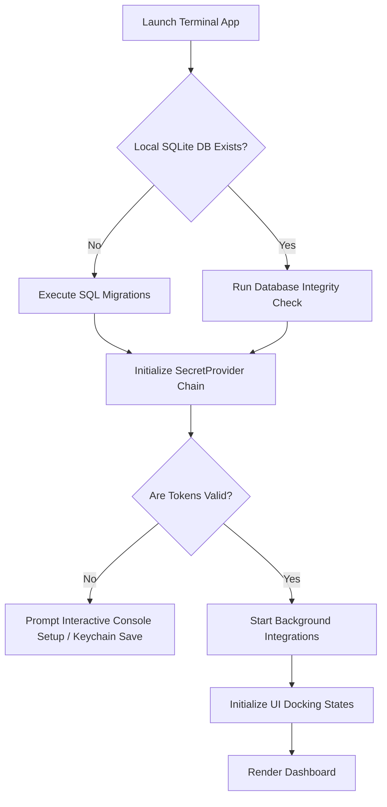
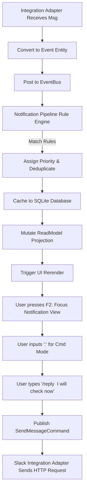
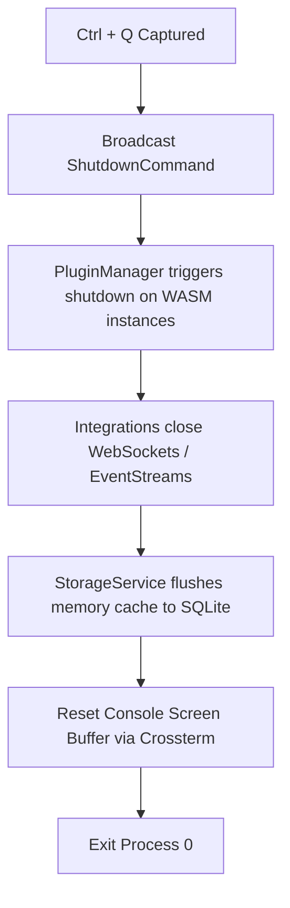

# User Flows Specification

This document maps the stateful transition paths of user interactions inside the Terminal Workspace.

---

## 1. Startup & Authentication Flow

On executing `terminal-workspace` in the console:

---

## 2. Notification Reception & Reply Flow

When a Slack DM or Github Review Request occurs:

---

## 3. Graceful Termination Flow

When the user exits via `Ctrl + Q`:

