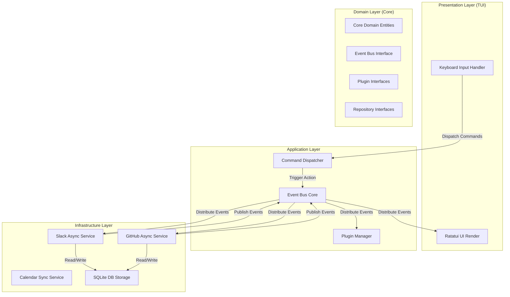

# System Architecture Specification

This document details the system architecture of the Terminal Workspace. The project is designed with a **Clean Architecture** approach using **Rust** and **Tokio** as the core async runtime to ensure memory safety, high performance, high cohesion, and low coupling.

> **Implementation Status (Phase 14, `step14.md`, ADR-0017)**: this is an early, aspirational sketch — the real crate layout (`crates/*`, a flat Cargo workspace, not the nested `core/`/`plugins/sdk/` tree shown below) has diverged since Phase 2. The "Plugin Manager" box is real as of Phase 14: `crates/plugin-host`'s `PluginHostManager` discovers `.wasm` Component-Model plugins, sandboxes each with `wasmtime` (fuel + memory limits, `docs/04-extensions/plugin-lifecycle.md`), and — matching the "Distribute Events -> Plugin Manager" edge below — is registered as an `EventHandler` on the same `EventDispatcher`/`EventBus` every other handler uses (`crates/app/src/main.rs`). The plugin SDK lives at `crates/plugin-sdk` (WIT contract only; see its own Implementation Status note in `docs/04-extensions/plugin-sdk.md` for why individual plugin crates don't depend on it directly).

## Architectural Overview

The system uses an **Event-Driven Architecture (EDA)** with a central **Event Bus**. Every integration (Slack, GitHub, Calendar, Gmail, Jira) runs as an isolated async service that publishes events to and consumes events from the Event Bus. The Presentation Layer (TUI) acts as a passive consumer of UI state updates and a producer of commands.



---

## Clean Architecture Layers

1. **Domain Layer (`core/src/domain`)**
   - Contains core business entities (e.g., `Message`, `PullRequest`, `EventNotification`, `UserPresence`).
   - Declares core interfaces (Rust Traits) for the Event Bus, Storage, and Plugins.
   - **Constraint**: Must have zero external dependencies other than standard library types to ensure core logic remains untainted by third-party APIs or protocols.

2. **Application Layer (`core/src/application`)**
   - Coordinates system use cases (e.g., "Receive and notify slack message", "Refresh github dashboard").
   - Implements the central Command Dispatcher and Event Router.
   - **Constraint**: Handles orchestration but does not know how SQLite writes to disk or how Slack makes HTTP requests.

3. **Infrastructure Layer (`infrastructure/`)**
   - Implements traits defined in the Domain.
   - Includes SQLite storage backend, HTTP client wrappers for Slack/GitHub/Jira, and credential storage.
   - **Constraint**: Translates external DTOs (Data Transfer Objects) into Domain Entities before passing them up.

4. **Presentation Layer (`tui/`)**
   - Built on `Ratatui` and `crossterm`.
   - Listens to terminal events (key presses, mouse clicks) and dispatches them as Commands.
   - Subscribes to TUI State Change events to re-render components reactively.

---

## Workspace Directory Structure

The repository uses a **Cargo Workspace** to enforce clear boundaries between components and compilation safety.

```text
terminal-workspace/
├── Cargo.toml                  # Workspace definition
├── docs/                       # Architecture and design documentation
├── core/                       # Core domain & application logic
│   ├── Cargo.toml
│   └── src/
│       ├── domain/             # Entities & Interface Traits (Event Bus, Plugin SDK)
│       └── application/        # Use cases, Command Router, Plugin Manager
├── tui/                        # Presentation Layer (Ratatui UI)
│   ├── Cargo.toml
│   └── src/                    # Rendering loops, view components, keyboard routing
├── infrastructure/             # Concrete adapters
│   ├── Cargo.toml
│   └── src/
│       ├── storage/            # SQLite implementation, migrations
│       ├── integrations/       # Slack, GitHub, Gmail, Calendar, Jira sync tasks
│       └── config/             # TOML configuration parser
└── plugins/                    # Plugin workspace (Dynamic compilation or WASM targets)
    └── sdk/                    # SDK crate imported by third-party plugins
```

---

## Async Runtime Design

The application runs on a multi-threaded **Tokio Runtime**.
- **Main Thread**: Dedicated to the Ratatui render loop and keyboard event listener.
- **Worker Tasks**: Slack, GitHub, and calendar synchronization tasks run on separate green threads spawned via `tokio::spawn`.
- **Inter-Task Communication**:
  - `tokio::sync::broadcast`: Used for 1-to-many communication (e.g., Event Bus distribution where multiple panels/plugins listen to the same event).
  - `tokio::sync::mpsc`: Used for many-to-1 communication (e.g., worker tasks sending commands back to the main UI event loop).
