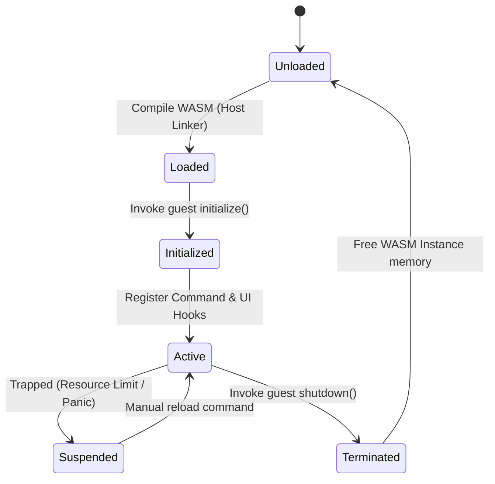

# Plugin Lifecycle Specification

This document defines the lifecycle states, WebAssembly hook transitions, and runtime boundary controls managed by the `PluginManager`.

> **Implementation Status (Phase 14, `step14.md`)**: the real type is `PluginHostManager` (`crates/plugin-host/src/lib.rs`), not `PluginManager`. §3's fuel (1,000,000/call) and memory (64MB) limits are implemented exactly as specified and verified against real traps from two deliberately-broken example plugins (`examples/plugins/looper`, `examples/plugins/memhog`) — not just asserted. Two things below are **not yet built**: the specific `PLUGIN_CPU_LIMIT_EXCEEDED` error code (the real implementation logs a `WorkspaceError::Plugin` with a free-form message and a real `tracing` error including the guest's own wasm backtrace, which turned out to be more useful for debugging than a fixed code) and the `Suspended -> Active` "manual reload command" transition (a trapped plugin's instance is dropped and stays unloaded until the next full `load_all()` — no `/plugin reload <id>`-style command exists yet, since no plugin-registered command surface exists yet either, per `step14.md`'s deliberately narrow scope).

---

## 1. Lifecycle State Diagram

The lifecycle of any WASM plugin is governed by the state machine below:

---

## 2. Transition Hook Executables

The `PluginManager` invokes Guest FFI bindings during lifecycle transitions:

### 1. `initialize()`
- **Host Action**: Allocates memory blocks and writes initial TOML/JSON configuration settings. Passes the configuration buffer pointer to the Wasm guest.
- **Guest Action**: Initializes internal memory caches, parses configurations, and allocates state.

### 2. `shutdown()`
- **Host Action**: Notifies the guest that the workspace is terminating.
- **Guest Action**: Flushes transient caches to pre-opened virtual files, closes pending sync timers, and prepares memory for unloading.

---

## 3. Resource & Instruction Limits (Wasmtime Runtime Bounds)

To prevent third-party plugins from locking the CPU or leaking memory, we enforce strict limits using `wasmtime` engine constraints:

### 1. CPU Execution Budget (Fuel)
- **Mechanism**: We enable Wasmtime instruction counting ("Fuel").
- **Limit**: Each event handled by the plugin is allocated a maximum of 1,000,000 instructions (fuel ticks).
- **Enforcement**: If the guest runs an infinite loop, the fuel is depleted. Wasmtime traps the execution, the `PluginManager` catches the exception, logs a `PLUGIN_CPU_LIMIT_EXCEEDED` error, suspends the plugin, and frees the instance.

### 2. Memory Limits (Linear Memory Limits)
- **Mechanism**: Configure Wasmtime's `Store` memory limiters.
- **Limit**: 64MB maximum heap allocation.
- **Enforcement**: Any guest allocation request that pushes memory usage past 64MB returns an out-of-memory error inside WASM or traps the execution.
