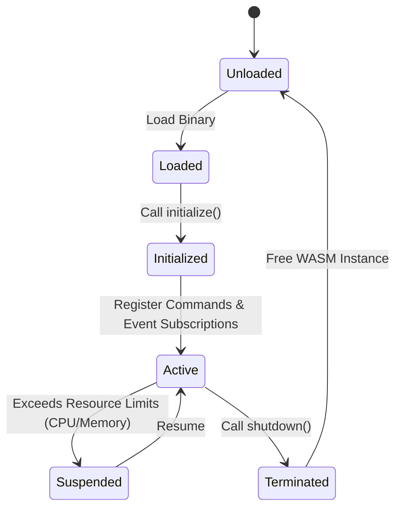

# Plugin System Specification

To support extensibility without sacrificing core application stability, the Terminal Workspace utilizes a **WebAssembly (WASM)-first Plugin Architecture**. Plugins run inside a sandboxed VM powered by `wasmtime`.

> **Implementation Status (Phase 14, `step14.md`, ADR-0002/0009/0017)**: the real host-guest boundary is the WebAssembly **Component Model** (WIT, `wit-bindgen`/`wasmtime::component::bindgen!`) — see `docs/04-extensions/plugin-sdk.md`'s Implementation Status note and `crates/plugin-sdk/wit/plugin-sdk.wit`. The "Host-Guest Interaction (FFI Boundary)" section below (raw pointers into WASM linear memory, `guest_on_event(ptr, len)`-style hand-rolled exports) describes the alternative ADR-0009 explicitly rejected as unsafe ("defeats Rust's memory safety guarantees") — kept below only as the historical draft that motivated writing ADR-0009 in the first place, not as what was built. Likewise, the native `trait Plugin`/`PluginCommand` shown under "Plugin Interface" below was never going to be what a sandboxed WASM guest implements (component exports are synchronous calls across the canonical ABI, not native Rust trait objects) — the real guest-facing shape is the `Guest` trait `wit-bindgen` generates from the WIT world (`crates/plugin-sdk/src/lib.rs`). Plugin-registered commands/UI panels (`PluginCommand`, the unified registries from ADR-0010) are explicitly deferred past this phase (`step14.md`'s Context) — the real WIT world only exports `initialize`/`on-event`/`shutdown`, no command/panel registration surface yet.

## Architecture Decision Context

- **Security & Stability**: Third-party plugins cannot execute arbitrary system calls (like `rm -rf`) or access the raw filesystem unless explicitly granted via capabilities. A plugin crash will not crash the workspace.
- **Cross-language**: Plugins can be written in Rust, Go (TinyGo), TypeScript (extism), or C/C++ as long as they compile to WASM.

---

## Plugin Interface (Rust SDK API)

Plugins interact with the host system using WebAssembly Component Model or a simplified Guest-Host FFI interface using standard buffers.

### SDK Trait Definition

```rust
pub trait Plugin: Send + Sync {
    /// Called immediately after the plugin binary is loaded into memory.
    /// Used for initial configuration parsing and self-check.
    fn initialize(&self, config: String) -> Result<(), PluginError>;

    /// Returns list of custom terminal commands the plugin registers to the Command Dispatcher.
    fn commands(&self) -> Vec<PluginCommand>;

    /// Handles events dispatched from the Host Event Bus.
    /// The event is passed as a serialized JSON string.
    fn on_event(&self, event_json: &str) -> Result<(), PluginError>;

    /// Invoked before the workspace exits to gracefully close connections or save local state.
    fn shutdown(&self) -> Result<(), PluginError>;
}
```

### Registered Command Struct

```rust
pub struct PluginCommand {
    pub name: String,          // Command string (e.g., "/slack-send")
    pub description: String,   // Helper description displayed in UI autocomplete
    pub trigger_chars: String, // Char array triggering auto-complete panel (e.g., "/")
}
```

---

## Plugin Lifecycle States

The Plugin Manager controls state transitions of each plugin:



### Lifecycle Phases
1. **Load**: The `.wasm` file is read from the configured plugins directory. `wasmtime` compiles the binary to machine code.
2. **Initialize**: Host allocates local memory and passes initial workspace settings.
3. **Subscribe**: Host queries the plugin for commands and event filters. The plugin registers hooks.
4. **Run (Active)**: The plugin listens to filtered Event Bus streams and handles custom commands.
5. **Shutdown**: Free resources, close file descriptors, and commit cached state.
6. **Unload**: Host releases references to the guest module.

---

## Host-Guest Interaction (FFI Boundary)

Since WASM does not native-share Rust objects, parameters are passed via shared memory linear buffers or serialized JSON messages.

- **Host-to-Guest**: Host writes the event JSON to WASM memory allocation and invokes `guest_on_event(ptr, len)`.
- **Guest-to-Host**: Plugins call Host-provided imports (WASM Host Functions) such as:
  - `host_publish_event(ptr, len)`: Publish a new event to the host Event Bus.
  - `host_get_config(ptr, len)`: Query system settings.
  - `host_log(level, ptr, len)`: Output log messages to system logger.
